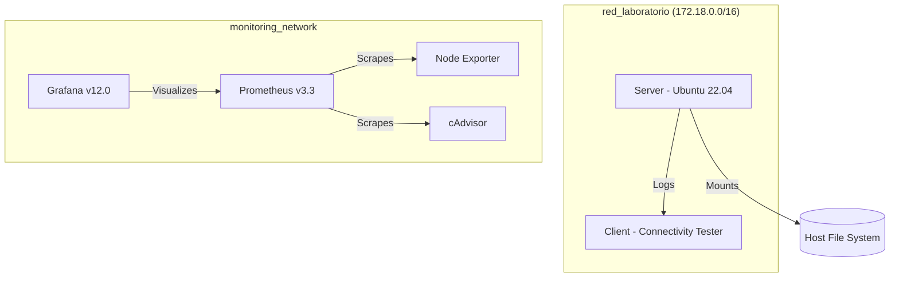

# 🐧 Linux Lab: Infrastructure as Code & Secure Network Administration


## 📋 Overview
This project represents a comprehensive implementation of a **Secure, Automated, and Containerized Linux Network Infrastructure**. Designed for advanced system administration, it leverages Docker and WSL2 to simulate a robust enterprise environment.

The solution integrates critical components of modern systems administration:
*   **Security & Identity**: Role-based access control (RBAC), password policies, and strict permission schemas.
*   **Automation**: Custom Bash orchestration for backups, health checks, and service management.
*   **Observability**: A full metrics stack featuring Prometheus, Grafana, Node Exporter, and cAdvisor.
*   **Resilience**: Persistent data volumes and redundant backup strategies.

---

## 🏗️ Architecture

The infrastructure is organized into isolated networks to ensure security and traffic separation.



### Core Components:
1.  **Server (Ubuntu 22.04)**: The central node managing users, logs, scheduled tasks, and a secure web-based log viewer.
2.  **Client**: A dedicated node for network validation and service consumption testing.
3.  **Observability Stack**: Real-time monitoring of host and container performance.

---

## 🎯 Use Cases
This laboratory is ideal for:
*   **Educational Environments**: A safe, sandbox environment for students to practice Linux administration (users, permissions, cron, backups) without risking host system stability.
*   **DevSecOps Prototyping**: Testing automation scripts and security policies in a containerized CI/CD-like pipeline before deploying to production servers.
*   **Observability Training**: Learning how to configure Prometheus scrapers and design Grafana dashboards for system and container metrics.
*   **Network Service Testing**: Simulating client-server architectures, firewall rules, and service availability in isolated Docker networks.

---

## 🚀 Quick Start

### Prerequisites
*   **Docker Desktop** (WSL2 Backend) or **Docker Engine**.
*   **Docker Compose** v2.0+.

### Deployment
```bash
# 1. Clone and enter the directory
git clone <repository-url>
cd lab-linux

# 2. Build and launch the infrastructure
docker compose up -d --build

# 3. Verify services are healthy
docker compose ps
```

---

## 🛠️ Usage & Administration Guide

### 1. User & Security Management
The server comes pre-configured with a `labadmin` user. To manage additional users:

*   **Access the Server Shell**:
    ```bash
    docker exec -it server bash
    ```
*   **Create a New User**:
    ```bash
    useradd -m -s /bin/bash usuario1
    echo "usuario1:Password123!" | chpasswd
    ```
*   **Check Password Expiration**:
    ```bash
    chage -l labadmin
    ```

### 2. Manual Automation Tasks
While tasks are automated via `cron`, you can trigger them manually for testing:

*   **Trigger a Backup**:
    ```bash
    docker exec server /opt/lab/scripts/backup.sh
    # Check the result in the host: ls ./data/backups
    ```
*   **Verify Disk Quotas**:
    ```bash
    docker exec server /opt/lab/scripts/check_quotas.sh
    ```

### 3. Log Inspection & Auditing
There are three ways to audit the system:
1.  **Web Viewer**: Navigate to `http://localhost:8080` to see a listing of all `.log` files.
2.  **Syslog**: Use `docker exec server cat /var/log/lab/syslog` to see system events.
3.  **Host Persistence**: Check the `./data/logs/` directory in your project folder.

---

## 📊 Monitoring & Observability

The project includes a pre-provisioned monitoring stack that automatically discovers all infrastructure components.

### 📈 Metrics Dashboards (Grafana)
1.  Open `http://localhost:3000` (Login: `admin` / `admin`).
2.  **Explore**: Use the "Explore" tab to query metrics like `node_memory_MemFree_bytes` or `container_cpu_usage_seconds_total`.
3.  **Visualizations**: Create custom dashboards to track the health of the `server` and `client` containers.

### 🔍 Service Discovery (Prometheus)
Navigate to `http://localhost:9090/targets` to verify that the following agents are being scraped:
*   `node-exporter`: Host-level hardware metrics.
*   `cadvisor`: Container-level resource usage.
*   `prometheus`: Internal metrics.

---

## ✅ Evidence of Operation
The system has been validated against the following criteria:

*   **Infrastructure Health**: All 5 containers (`server`, `client`, `prometheus`, `grafana`, `node-exporter`) report `Up` status.
*   **Network Connectivity**: Verified low-latency communication (avg 0.08ms) between nodes.
*   **Resilience**: Verified that data in `/home` and `/var/log` survives a `docker compose down && docker compose up`.
*   **Security Audit**: Verified that sensitive directories like `/var/backups` have `700` permissions.

---

## 📂 Project Structure
```text
~/lab-linux/
├── docker-compose.yml       # Infrastructure orchestration
├── server/
│   ├── Dockerfile           # Custom Ubuntu image (rsyslog, cron, ssh)
│   ├── scripts/             # Admin (backup, quotas, sysinfo)
│   └── cron/                # Root crontab configuration
├── client/
│   └── Dockerfile           # Ubuntu-based tester (curl, ping)
├── monitoring/
│   ├── prometheus/          # Scrape & retention configs
│   └── grafana/             # Auto-provisioned datasources
└── data/                    # Bind mounts for persistent logs & backups
```

---

## 🎓 Conclusion
This project demonstrates that modern Linux administration is moving towards **Immutable Infrastructure**. By defining the server state via Dockerfiles and scripts, we ensure that the entire network environment is reproducible, secure, and easy to monitor.

**Course**: Administración de Redes  
**Status**: Final Delivery Ready  
**Date**: April 2026
