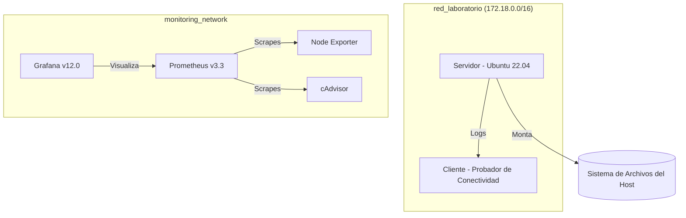

# Laboratorio Linux: Infraestructura como Código y Administración de Redes Seguras


## Descripción General
Este proyecto representa una implementación integral de una **Infraestructura de Red Linux Segura, Automatizada y Contenedorizada**. Diseñada para la administración avanzada de sistemas, utiliza Docker y WSL2 para simular un entorno empresarial robusto.

La solución integra componentes críticos de la administración de sistemas modernos:
*   **Seguridad e Identidad**: Control de acceso basado en roles (RBAC), políticas de contraseñas y esquemas estrictos de permisos.
*   **Automatización**: Orquestación mediante scripts de Bash personalizados para respaldos, verificaciones de estado y gestión de servicios.
*   **Observabilidad**: Un stack completo de métricas que incluye Prometheus, Grafana, Node Exporter y cAdvisor.
*   **Resiliencia**: Volúmenes de datos persistentes y estrategias de respaldo redundantes.

---

## Arquitectura

La infraestructura está organizada en redes aisladas para garantizar la seguridad y la separación del tráfico.



### Componentes Principales:
1.  **Servidor (Ubuntu 22.04)**: El nodo central que gestiona usuarios, registros, tareas programadas y un visor de logs seguro basado en web.
2.  **Cliente**: Un nodo dedicado para la validación de red y pruebas de consumo de servicios.
3.  **Stack de Observabilidad**: Monitoreo en tiempo real del rendimiento del host y de los contenedores.

---

## Casos de Uso
Este laboratorio es ideal para:
*   **Entornos Educativos**: Un entorno seguro de pruebas (sandbox) para que los estudiantes practiquen la administración de Linux (usuarios, permisos, cron, respaldos) sin arriesgar la estabilidad del sistema host.
*   **Prototipado DevSecOps**: Prueba de scripts de automatización y políticas de seguridad en un pipeline contenedorizado similar a CI/CD antes de desplegar en servidores de producción.
*   **Entrenamiento en Observabilidad**: Aprendizaje sobre cómo configurar recolectores de Prometheus y diseñar tableros de Grafana para métricas de sistema y contenedores.
*   **Pruebas de Servicios de Red**: Simulación de arquitecturas cliente-servidor, reglas de firewall y disponibilidad de servicios en redes Docker aisladas.

---

## Inicio Rápido

### Requisitos Previos
*   **Docker Desktop** (Backend WSL2) o **Docker Engine**.
*   **Docker Compose** v2.0+.

### Despliegue
```bash
# 1. Clonar y entrar al directorio
git clone <repository-url>
cd lab-linux

# 2. Construir y lanzar la infraestructura
docker compose up -d --build

# 3. Verificar que los servicios estén saludables
docker compose ps
```

---

## Guía de Uso y Administración

### 1. Gestión de Usuarios y Seguridad
El servidor viene preconfigurado con un usuario `labadmin`. Para gestionar usuarios adicionales:

*   **Acceder a la terminal del servidor**:
    ```bash
    docker exec -it server bash
    ```
*   **Crear un nuevo usuario**:
    ```bash
    useradd -m -s /bin/bash usuario1
    echo "usuario1:Password123!" | chpasswd
    ```
*   **Verificar la expiración de la contraseña**:
    ```bash
    chage -l labadmin
    ```

### 2. Tareas Manuales de Automatización
Aunque las tareas están automatizadas vía `cron`, puedes activarlas manualmente para pruebas:

*   **Ejecutar un Respaldo**:
    ```bash
    docker exec server /opt/lab/scripts/backup.sh
    # Verificar el resultado en el host: ls ./data/backups
    ```
*   **Verificar Cuotas de Disco**:
    ```bash
    docker exec server /opt/lab/scripts/check_quotas.sh
    ```

### 3. Inspección y Auditoría de Logs
Hay tres formas de auditar el sistema:
1.  **Visor Web**: Navega a `http://localhost:8080` para ver un listado de todos los archivos `.log`.
2.  **Syslog**: Usa `docker exec server cat /var/log/lab/syslog` para ver los eventos del sistema.
3.  **Persistencia en el Host**: Revisa el directorio `./data/logs/` en la carpeta de tu proyecto.

---

## Monitoreo y Observabilidad

El proyecto incluye un stack de monitoreo pre-provisionado que descubre automáticamente todos los componentes de la infraestructura.

### Tableros de Métricas (Grafana)
1.  Abre `http://localhost:3000` (Usuario: `admin` / Contraseña: `admin`).
2.  **Explorar**: Usa la pestaña "Explore" para consultar métricas como `node_memory_MemFree_bytes` o `container_cpu_usage_seconds_total`.
3.  **Visualizaciones**: Crea tableros personalizados para seguir la salud de los contenedores `server` y `client`.

### Descubrimiento de Servicios (Prometheus)
Navega a `http://localhost:9090/targets` para verificar que los siguientes agentes están siendo monitoreados:
*   `node-exporter`: Métricas de hardware a nivel de host.
*   `cadvisor`: Uso de recursos a nivel de contenedor.
*   `prometheus`: Métricas internas.

---

## Evidencia de Operación
El sistema ha sido validado contra los siguientes criterios:

*   **Salud de la Infraestructura**: Los 5 contenedores (`server`, `client`, `prometheus`, `grafana`, `node-exporter`) reportan estado `Up`.
*   **Conectividad de Red**: Comunicación de baja latencia verificada (promedio 0.08ms) entre nodos.
*   **Resiliencia**: Se verificó que los datos en `/home` y `/var/log` sobreviven a un `docker compose down && docker compose up`.
*   **Auditoría de Seguridad**: Se verificó que los directorios sensibles como `/var/backups` tienen permisos `700`.

---

## Estructura del Proyecto
```text
~/lab-linux/
├── docker-compose.yml       # Orquestación de la infraestructura
├── server/
│   ├── Dockerfile           # Imagen personalizada de Ubuntu (rsyslog, cron, ssh)
│   ├── scripts/             # Administración (respaldos, cuotas, sysinfo)
│   └── cron/                # Configuración de crontab de root
├── client/
│   └── Dockerfile           # Probador basado en Ubuntu (curl, ping)
├── monitoring/
│   ├── prometheus/          # Configuraciones de recolección y retención
│   └── grafana/             # Fuentes de datos auto-provisionadas
└── data/                    # Montajes vinculados para logs persistentes y respaldos
```

---

## Conclusión
Este proyecto demuestra que la administración moderna de Linux se está moviendo hacia la **Infraestructura Inmutable**. Al definir el estado del servidor a través de Dockerfiles y scripts, aseguramos que todo el entorno de red sea reproducible, seguro y fácil de monitorear.

**Curso**: Administración de Redes  
**Estado**: Listo para Entrega Final  
**Fecha**: Abril 2026
